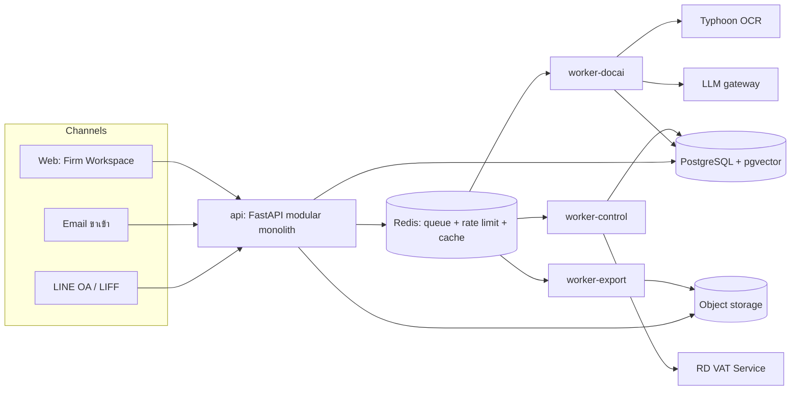
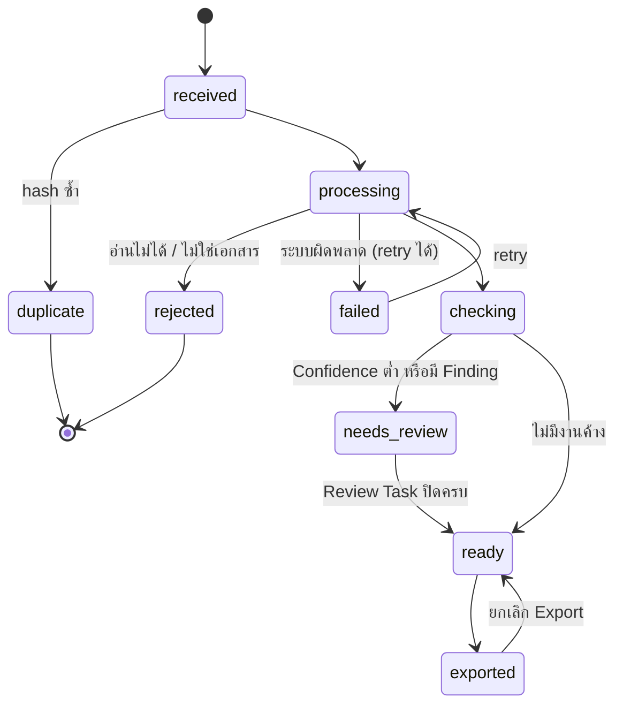
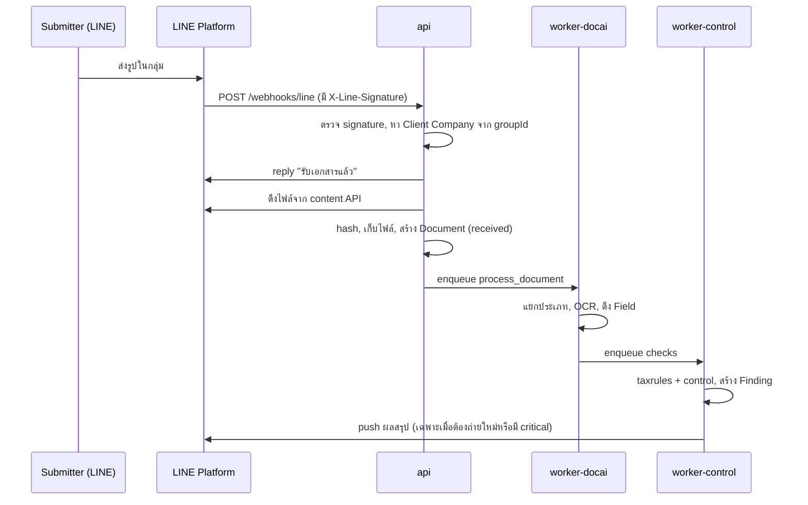

# Architecture

ระบบเป็น modular monolith ภาษา Python หนึ่งตัว บวก worker 3 ชนิดที่รันจาก codebase เดียวกัน และเว็บ Next.js หนึ่งตัว (ADR-0001) ทุก module คุยกันผ่าน public interface ของ module เท่านั้น เพื่อให้แยกเป็น service จริงได้ภายหลังโดยไม่ต้องรื้อ

## ภาพรวม



## Stack

| ชั้น | เลือก | หมายเหตุ |
| --- | --- | --- |
| ภาษา backend | Python 3.12 | |
| Web framework | FastAPI + Pydantic v2 | schema ของ API สร้างจาก Pydantic |
| ORM และ migration | SQLAlchemy 2 + Alembic | migration ทุกครั้งผ่าน Alembic เท่านั้น |
| Queue | Celery + Redis | 3 queue: `docai`, `control`, `export` |
| ฐานข้อมูล | PostgreSQL 16 + pgvector | row-level security ต่อ tenant (ADR-0005) |
| ที่เก็บไฟล์ | S3-compatible, เปิด server-side encryption | ไฟล์ต้นฉบับห้ามแก้ |
| OCR | Typhoon OCR ผ่าน OpenAI-compatible API (vLLM ที่รันเองหรือ opentyphoon.ai) | ADR-0006 |
| LLM | ผ่าน `adapters.llm` ที่สลับผู้ให้บริการได้ | ADR-0006 |
| Frontend | Next.js + TypeScript, LINE LIFF สำหรับหน้าที่เปิดจาก LINE | |
| Package manager | `uv` (Python), `pnpm` (TypeScript) | |
| Infra | Docker Compose สำหรับ dev, container บน cloud region ไทยหรือสิงคโปร์สำหรับ prod | |

stack นี้เป็นค่าที่เสนอ ถ้าจะเปลี่ยนตัวไหนให้ตัดสินก่อน ticket แรกของเฟส 1 และบันทึกเป็น ADR

## โครงสร้าง repo

```text
/
├── CLAUDE.md, CONTEXT.md, README.md
├── docs/                      เอกสารชุดนี้ + docs/adr/
├── apps/
│   ├── api/                   Python package `backoffice` (api + workers)
│   │   ├── src/backoffice/<module>/
│   │   ├── prompts/<name>/v<N>.md
│   │   ├── migrations/
│   │   └── tests/
│   └── web/                   Next.js (Firm Workspace + LIFF)
├── evals/                     Golden Set, runner, ผลย้อนหลัง
├── infra/                     docker-compose, IaC
└── .scratch/                  spec และ ticket
```

## Module

แต่ละ module มี `api.py` เป็น public interface ที่ module อื่น import ได้ ส่วนไฟล์อื่นเป็นของภายใน module

| Module | หน้าที่ | Public interface (ตัวอย่าง) | เฟส |
| --- | --- | --- | --- |
| `identity` | Firm, Client Company, Member, Role, session, รหัสเชิญ LINE | `get_current_member()`, `resolve_client_by_line_group()` | 1 |
| `ingest` | รับ Document จากทุกช่องทาง, hash กันซ้ำ, เก็บไฟล์, สร้าง Document | `receive_file()`, `receive_etax_xml()` | 1 |
| `docai` | แยกประเภท, OCR, ดึง Field, Confidence, embedding ของภาพ | `process_document()` | 1 |
| `taxrules` | Check ด้านภาษีทั้งหมดตาม `docs/TAX_RULES.md` | `run_tax_checks()` | 1 |
| `control` | เอกสารซ้ำ, ภาพคล้ายกัน, ลายเซ็นและตรายางซ้ำ, Vendor เปลี่ยนบัญชี | `run_control_checks()` | 1 |
| `review` | Review Task, Correction, ปิด Finding | `open_tasks_for()`, `apply_correction()` | 1 |
| `workflow` | Document Request, การแจ้งเตือน, (เฟส 2) การอนุมัติ, Payment Rule | `send_document_request()` | 1 |
| `export` | ไฟล์สำหรับโปรแกรมบัญชี, (เฟส 2) ไฟล์โอนเงินธนาคาร | `create_export()` | 1 |
| `leakage` | ควบคุมงาน Leakage Scan และสร้างรายงาน | `start_scan()`, `build_report()` | 1 |
| `audit` | บันทึกเหตุการณ์แบบเพิ่มอย่างเดียว | `record()` | 1 |
| `billing` | นับ usage, แพ็กเกจ, โควตา | `meter_document()` | 1 |
| `matching` | จับคู่ PO / ใบรับของ / ใบแจ้งหนี้, จับคู่เงินเข้า | | 2–3 |
| `payments` | Payment Run, policy engine, Kill Switch | | 2 |

Adapter ของระบบภายนอกอยู่ใน `backoffice/adapters/`: `line`, `email`, `storage`, `ocr`, `llm`, `rd_vat`, (เฟส 2) `bank` ทุก adapter มี fake สำหรับ test

## State ของ Document



state อยู่ในคอลัมน์ `documents.status` การเปลี่ยน state ทำผ่านฟังก์ชันเดียวใน `ingest` ที่ตรวจว่าการเปลี่ยนนั้นอยู่ในแผนภาพนี้ และบันทึก audit ทุกครั้ง

## Data flow หลัก

### รับเอกสารจาก LINE



webhook ต้องตอบ 200 ให้เร็วที่สุด งานที่ช้ากว่านั้นทุกอย่างเข้า queue

### ส่งออก

Member เลือก Client Company กับเดือนภาษี → `export.create_export()` รวบรวม Document ที่ Ready ยังไม่เคยส่งออก → worker-export สร้างไฟล์ → Document เปลี่ยนเป็น `exported` → Member ดาวน์โหลดผ่าน signed URL

### Leakage Scan

อัปโหลดชุดไฟล์ → `leakage.start_scan()` สร้าง Document ทุกฉบับด้วยแหล่งที่มา `leakage_scan` → รันงานผ่าน queue ในช่วง batch กลางคืน → `leakage.build_report()` รวม Finding เป็นรายงาน Document จากงานนี้ไม่ถูกนับ usage แบบรายเดือน คิดเงินต่องานแทน

## AI pipeline

1. **Hash ก่อน** ถ้าไฟล์เคยประมวลผลแล้ว ใช้ผลเดิม
2. **e-Tax XML** อ่านจาก XML ตรงๆ ไม่ผ่าน OCR และให้ Confidence = 1
3. **แยกประเภท** ด้วยโมเดลเล็กก่อน
4. **OCR** ด้วย Typhoon OCR ได้ markdown พร้อมตาราง
5. **ดึง Field** ด้วย LLM ระดับ `small` หรือ `medium` ให้ตอบเป็น JSON ตาม schema ของ Document Type (กฎการเขียน prompt อยู่ใน `docs/GUIDELINES.md`)
6. **ตรวจความสอดคล้อง** ด้วยโค้ด เช่นฐานภาษี + VAT = ยอดรวม ถ้าไม่ตรงลด Confidence ของช่องเหล่านั้น
7. **ส่งต่อโมเดลใหญ่** เฉพาะ Document ที่ Confidence รวมต่ำกว่าเกณฑ์
8. **Embedding ของภาพ** สำหรับ `control` ใช้หาเอกสารคล้ายกัน

LLM ไม่ตัดสินผลของ Check ใดๆ (ADR-0003)

`adapters.llm` บันทึกโมเดล token และต้นทุนของทุกการเรียกลงตาราง `ai_calls` และหยุดเรียกเมื่อถึงงบรายวันของ tenant (ค่าเริ่มต้นใน `docs/SECURITY.md`)

## ระบบภายนอก

| ระบบ | ใช้ทำอะไร | หมายเหตุ |
| --- | --- | --- |
| LINE Messaging API | รับ webhook, reply, push, ดึงไฟล์ | reply ไม่นับโควตาข้อความ push นับ ออกแบบให้ใช้ reply เป็นหลัก |
| LINE Login / LIFF | ยืนยันตัวตน Submitter และ Member | ตรวจ ID token ฝั่ง server |
| RD VAT Service | ตรวจ Vendor จด VAT และสาขา | SOAP ของกรมสรรพากร, cache ผล 30 วัน, จำกัด 2 คำขอต่อวินาที |
| Email ขาเข้า | รับ email ที่ forward มา | ผู้ให้บริการที่ส่ง webhook พร้อม signature |
| OCR / LLM | อ่านเอกสาร | ผ่าน adapter เท่านั้น |
| โปรแกรมบัญชี | ปลายทาง Export | เฟส 1 เป็นไฟล์นำเข้า |

รายละเอียด endpoint และ payload อยู่ใน `docs/API_SPEC.md`

## Environment

| ชื่อ | ใช้ทำอะไร | ข้อมูล |
| --- | --- | --- |
| `local` | พัฒนาบนเครื่อง ผ่าน Docker Compose | สังเคราะห์เท่านั้น |
| `staging` | ทดสอบก่อนปล่อย ใช้ LINE channel แยก | สังเคราะห์และข้อมูลทดลองที่ลูกค้ายินยอม |
| `production` | ลูกค้าจริง | ข้อมูลจริง |

ค่าตั้งทุกตัวมาจาก environment variable ดูรายการที่ `.env.example` ใน repo (เมื่อ scaffold แล้ว)

## Observability

- log แบบ JSON มี `request_id`, `tenant_id`, `document_id` ทุกบรรทัดที่เกี่ยวข้อง
- metric หลัก: เวลาจาก received ถึง ready, จำนวน Document ต่อ state, ต้นทุน AI ต่อ Document, อัตรา Finding ต่อ Check, อัตรา error ของ adapter
- ข้อมูลส่วนบุคคลใน log ต้องปิดบังตาม `docs/SECURITY.md`

## เมื่อไรค่อยแยกเป็น service

แยก module ออกเป็น service จริงเมื่อเกิดข้อใดข้อหนึ่ง และบันทึกเป็น ADR ทุกครั้ง

- worker ชนิดนั้นต้องการ hardware ต่างจากที่เหลือ เช่น GPU สำหรับ OCR ที่รันเอง
- module นั้น deploy บ่อยกว่าส่วนอื่นอย่างเห็นได้ชัดจนทำให้ release ติดกัน
- ทีมโตจนมีคนดูแล module นั้นเป็นหลัก
