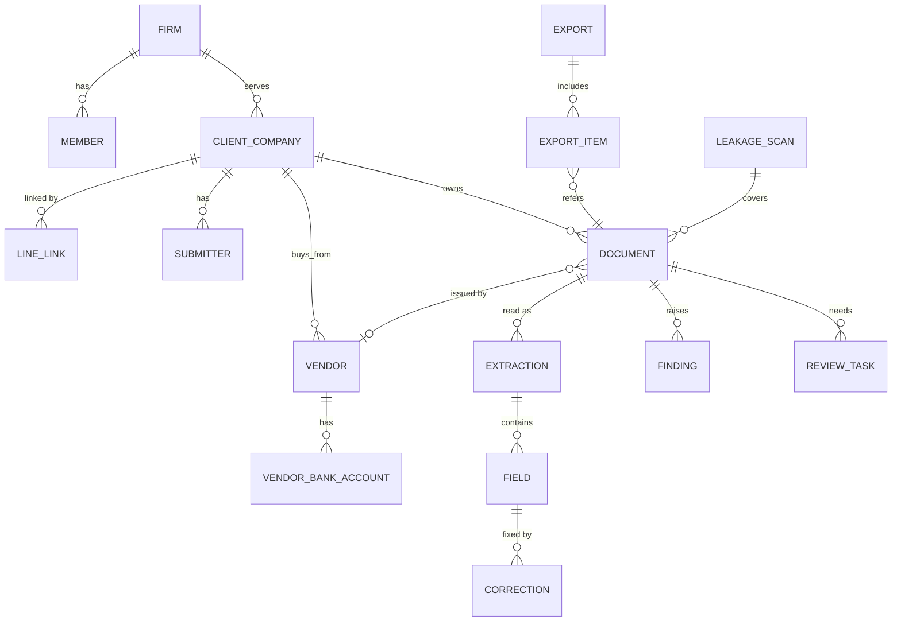

# Data Model

ฐานข้อมูลเดียว (PostgreSQL) ทุกตารางที่มีข้อมูลลูกค้ามีคอลัมน์ `firm_id` และถูกกรองด้วย row-level security (ADR-0005) เอกสารนี้คือสัญญาของ schema ส่วน migration จริงอยู่ใน `apps/api/migrations/`

## กติกาทั่วไป

| เรื่อง | กติกา |
| --- | --- |
| Primary key | UUIDv7 ชื่อ `id` |
| เวลา | `timestamptz` เก็บเป็น UTC แสดงผลเป็น Asia/Bangkok |
| วันที่ในเอกสาร | `date` แปลงปี พ.ศ. เป็น ค.ศ. ตอนดึงข้อมูล และเก็บค่าดิบไว้ใน Field |
| เงิน | `NUMERIC(18,2)` ใน DB และ `Decimal` ใน Python ปัดแบบ ROUND_HALF_UP |
| สกุลเงิน | คอลัมน์ `currency` ค่าเริ่มต้น `THB` |
| เลขประจำตัวผู้เสียภาษี | `char(13)` ตัวเลขล้วน ตรวจ checksum ก่อนบันทึก เลขสาขา `char(5)` สำนักงานใหญ่ = `00000` |
| Soft delete | คอลัมน์ `deleted_at` ห้ามลบแถวจริงยกเว้นตามนโยบายลบข้อมูลใน `docs/SECURITY.md` |
| Tenant | ทุกตารางข้อมูลลูกค้ามี `firm_id NOT NULL` และตารางใต้ Client Company มี `client_company_id` ด้วย |
| Enum | เก็บเป็น `text` + CHECK constraint เพื่อเพิ่มค่าได้ง่าย |

## ความสัมพันธ์

## ตาราง

### Tenant และผู้ใช้

**`firms`**: `id`, `name`, `tax_id`, `is_shadow` (true = สร้างให้ Direct Company), `plan`, `created_at`

**`members`**: `id`, `firm_id`, `email`, `line_user_id`, `display_name`, `role` (`firm_owner` | `firm_staff` | `platform_admin`), `status`

**`client_companies`**: `id`, `firm_id`, `legal_name`, `tax_id`, `branch_code`, `address`, `vat_registered`, `accounting_software` (`express` | `flowaccount` | `peak` | `excel` | `other`), `fiscal_year_end`, `status`

**`line_links`**: `id`, `firm_id`, `client_company_id`, `line_group_id` หรือ `line_user_id`, `invite_code`, `linked_at` (unique ต่อ `line_group_id`)

**`submitters`**: `id`, `firm_id`, `client_company_id`, `line_user_id`, `email`, `display_name`

### เอกสาร

**`documents`**: `id`, `firm_id`, `client_company_id`, `source` (`line` | `email` | `upload` | `etax_xml` | `leakage_scan`), `submitter_id`, `leakage_scan_id`, `file_key`, `file_sha256`, `mime_type`, `page_count`, `document_type`, `status` (ตาม state ใน `docs/ARCHITECTURE.md`), `tax_period` (เดือนภาษี `YYYY-MM`), `vendor_id`, `received_at`, `ready_at`

- unique `(client_company_id, file_sha256)` กันไฟล์ซ้ำ
- index `(firm_id, client_company_id, tax_period, status)` สำหรับหน้า Firm Workspace

**`extractions`**: `id`, `firm_id`, `document_id`, `pipeline_version`, `ocr_model`, `llm_model`, `prompt_version`, `overall_confidence`, `raw_ocr_key`, `created_at`, `is_current`

**`fields`**: `id`, `firm_id`, `extraction_id`, `name` (ตาม schema ของ Document Type), `value_text`, `value_normalized` (jsonb), `confidence`, `bbox` (jsonb: หน้า, x, y, w, h), `source` (`ocr_llm` | `xml` | `correction`)

**`document_line_items`**: `id`, `firm_id`, `extraction_id`, `line_no`, `description`, `quantity`, `unit_price`, `amount`

**`document_embeddings`**: `document_id`, `firm_id`, `kind` (`page_image` | `signature_crop` | `stamp_crop`), `page`, `embedding vector(...)`, `phash` (bigint) ขนาด vector ตั้งตามโมเดลที่เลือก

### การตรวจ

**`findings`**: `id`, `firm_id`, `document_id`, `rule_id` (ตาม `docs/TAX_RULES.md`), `rule_version`, `severity` (`critical` | `warning` | `info`), `result` (`fail` | `unverified`), `message_th`, `evidence` (jsonb), `amount_at_risk`, `status` (`open` | `accepted` | `dismissed`), `resolved_by`, `resolved_reason`, `resolved_at`

**`review_tasks`**: `id`, `firm_id`, `document_id`, `reason` (`low_confidence` | `finding`), `field_names` (text[]), `assignee_member_id`, `status` (`open` | `claimed` | `done`), `created_at`, `done_at`

**`corrections`**: `id`, `firm_id`, `field_id`, `old_value`, `new_value`, `member_id`, `created_at`

**`vat_registry_cache`**: `tax_id`, `branch_code`, `is_registered`, `name`, `address`, `registered_since`, `checked_at` (ไม่มี `firm_id` เพราะเป็นข้อมูลสาธารณะของกรมสรรพากร)

### คู่ค้า

**`vendors`**: `id`, `firm_id`, `client_company_id`, `tax_id`, `branch_code`, `name`, `first_seen_at`

**`vendor_bank_accounts`**: `id`, `firm_id`, `vendor_id`, `bank_code`, `account_no_hash`, `account_no_last4`, `status` (`unverified` | `verified`), `verified_by`, `verified_at`, `first_seen_document_id` เก็บทุกเลขที่เคยเห็น ไม่แก้ทับ

### การส่งออกและงานย้อนหลัง

**`exports`**: `id`, `firm_id`, `client_company_id`, `tax_period`, `target`, `file_key`, `status`, `created_by`, `created_at`

**`export_items`**: `export_id`, `document_id`, `firm_id` (unique `document_id` ใน Export ที่ไม่ถูกยกเลิก)

**`leakage_scans`**: `id`, `firm_id`, `client_company_id`, `status`, `document_count`, `report_key`, `total_amount_at_risk`, `started_at`, `finished_at`

**`document_requests`**: `id`, `firm_id`, `client_company_id`, `reason`, `message_th`, `sent_via`, `sent_at`, `fulfilled_document_id`

### ระบบ

**`audit_events`**: `id`, `firm_id`, `actor_type` (`member` | `submitter` | `system`), `actor_id`, `action`, `entity_type`, `entity_id`, `before` (jsonb), `after` (jsonb), `request_id`, `created_at` เพิ่มอย่างเดียว ไม่มี UPDATE หรือ DELETE

**`ai_calls`**: `id`, `firm_id`, `document_id`, `purpose`, `provider`, `model`, `input_tokens`, `output_tokens`, `cost_thb`, `latency_ms`, `created_at`

**`usage_records`**: `id`, `firm_id`, `client_company_id`, `document_id`, `period`, `unit` (`document` | `leakage_scan`), `quantity`

### เฟส 2 (ยังไม่สร้าง)

`payment_rules`, `payment_runs`, `payment_items`, `approvals`, `kill_switches` ออกแบบใน spec ของเฟส 2 ตามหลักใน `docs/SECURITY.md` หัวข้อความปลอดภัยการจ่ายเงิน

## Schema ของ Field ตาม Document Type

ชื่อ Field เป็นสัญญากลางระหว่าง `docai`, `taxrules`, `export` และ Golden Set

| Field | tax_invoice_full | tax_invoice_abbreviated | receipt | invoice |
| --- | --- | --- | --- | --- |
| `title_text` (คำหัวเอกสารเช่น "ใบกำกับภาษี") | บังคับ | บังคับ | มี | มี |
| `seller_name` | บังคับ | บังคับ | บังคับ | บังคับ |
| `seller_tax_id` | บังคับ | บังคับ | ถ้ามี | ถ้ามี |
| `seller_branch` | บังคับ | ถ้ามี | ถ้ามี | ถ้ามี |
| `seller_address` | บังคับ | | ถ้ามี | ถ้ามี |
| `buyer_name` | บังคับ | | ถ้ามี | ถ้ามี |
| `buyer_tax_id` | ถ้ามี | | ถ้ามี | ถ้ามี |
| `buyer_branch` | ถ้ามี | | | |
| `buyer_address` | บังคับ | | ถ้ามี | ถ้ามี |
| `document_no` | บังคับ | บังคับ | บังคับ | บังคับ |
| `book_no` | ถ้ามี | ถ้ามี | ถ้ามี | |
| `issue_date` | บังคับ | บังคับ | บังคับ | บังคับ |
| `line_items` | บังคับ | บังคับ | ถ้ามี | บังคับ |
| `subtotal` (มูลค่าก่อน VAT) | บังคับ | | ถ้ามี | ถ้ามี |
| `vat_amount` | บังคับ | | ถ้ามี | ถ้ามี |
| `total_amount` | บังคับ | บังคับ | บังคับ | บังคับ |
| `vat_included_statement` (ข้อความว่ารวม VAT แล้ว) | | บังคับ | | |
| `payment_method` | | | ถ้ามี | |

"บังคับ" ในตารางนี้คือช่องที่ `docai` ต้องพยายามดึง ส่วนการตัดสินว่าขาดแล้วผิดกฎหรือไม่เป็นหน้าที่ของ `taxrules`
