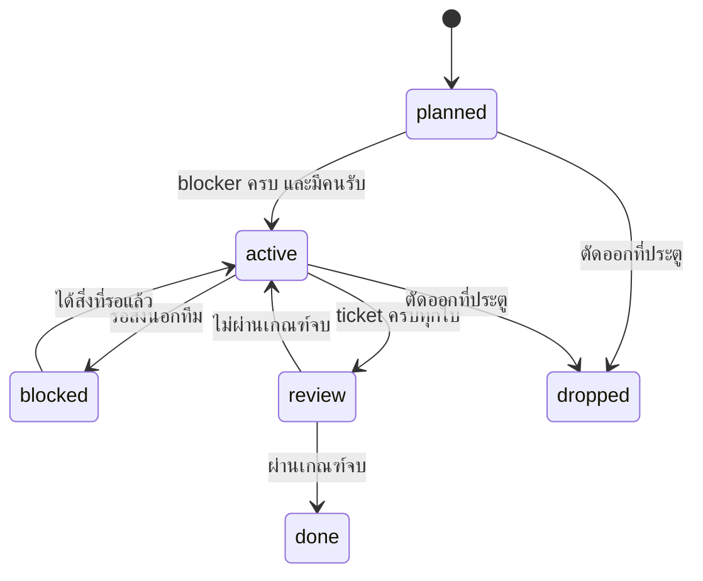
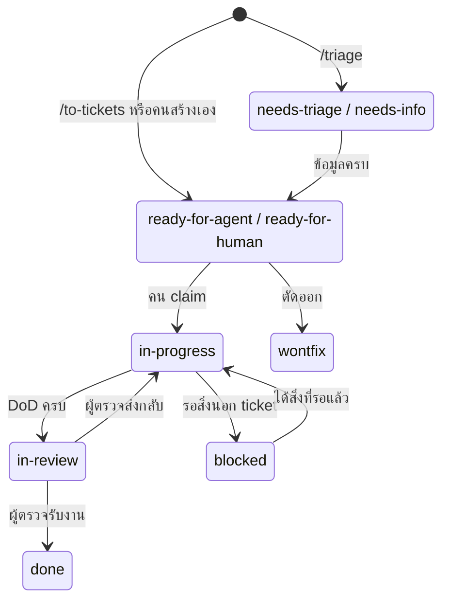

# Roadmap

สถานะของโปรเจกต์ในที่เดียว: ตอนนี้อยู่เฟสไหน milestone ไหนเดินอยู่ อะไรต่อ และประตูตัดสินใจอยู่ตรงไหน รายละเอียดงานระดับ ticket อยู่ใน `.scratch/<feature>/issues/` ไฟล์นี้เก็บแผนระดับ milestone และกติกาสถานะของทั้ง milestone และ ticket

## สถานะตอนนี้

- **วันที่อัปเดต:** 2026-09-24
- **เฟส:** 0 (พิสูจน์ปัญหา)
- **Milestone ที่เดินอยู่:** M0.1, M0.2, M0.3
- **ถัดไป:** M0.4, M0.5 แล้วเข้าประตู G0
- **ประตูถัดไป:** G1 วันที่ 2026-12-23

## State machine ของ milestone



### กติกาการอัปเดตไฟล์นี้

1. สถานะ milestone เปลี่ยนโดยคน: `planned → active` และ `blocked` ตัดสินในประชุมวันจันทร์ `active → review` ทำโดยผู้ตรวจที่ merge ticket ใบสุดท้ายของ milestone ทุกการแก้ไฟล์นี้เป็น PR เล็กบน branch `docs/<slug>`
2. `review → done` และทุกอย่างที่ไปถึง `dropped` เป็นการตัดสินของคน agent แก้ส่วน milestone ของไฟล์นี้เมื่อผู้ใช้สั่งเท่านั้น
3. ประตู (G0, G1, …) ผ่านหรือไม่ผ่านเป็นการตัดสินของคนเสมอ
4. ทุกการเปลี่ยนสถานะเพิ่มหนึ่งบรรทัดใน [บันทึก](#บันทึก) พร้อมวันที่และเหตุผล และอัปเดต "สถานะตอนนี้" ด้านบน
5. บรรทัดในบันทึกเพิ่มได้อย่างเดียว ห้ามแก้หรือลบบรรทัดเก่า

## State machine ของ ticket

ticket หนึ่งใบคือไฟล์เดียวใน `.scratch/<feature>/issues/<NN>-<slug>.md` เลข `<NN>` เริ่มใหม่ในทุก feature จึงเรียก ticket ด้วย **ID** `<feature>-<NN>` เช่น `line-inbox-03` และ branch ของ ticket คือ `t/<feature>-<NN>` สถานะอยู่ในบรรทัด `**Status:**` ใกล้หัวไฟล์ ความจำของงานอยู่ในไฟล์นี้กับ git ไม่ได้อยู่ใน chat ของ agent



| สถานะ | ความหมาย | ใครเปลี่ยนเป็นสถานะนี้ |
| --- | --- | --- |
| `needs-triage`, `needs-info` | ยังประเมินไม่เสร็จหรือรอข้อมูล claim ไม่ได้ | `/triage` |
| `ready-for-agent` | spec ครบ agent ทำได้เลย | `/to-tickets`, `/triage`, คน |
| `ready-for-human` | งานที่คนต้องทำเอง เช่นตั้งค่าบัญชีภายนอก คุยลูกค้า | `/to-tickets`, `/triage`, คน |
| `in-progress` | มีเจ้าของแล้ว คู่กับบรรทัด `**Owner:** <ชื่อ>` | คน |
| `blocked` | รอสิ่งนอก ticket เหตุผลอยู่ใน Progress note | agent หรือคน |
| `in-review` | ครบ Definition of Done ใน `docs/GUIDELINES.md` รอคน push และเปลี่ยน draft PR เป็น Ready for review | agent หรือคน |
| `done` | ผู้ตรวจรับงาน แล้ว squash merge | ผู้ตรวจเท่านั้น |
| `wontfix` | ตัดออก พร้อมเหตุผลใน `## Comments` | คน |

ทุกการเปลี่ยนสถานะเกิดบน branch ของ ticket แล้วเข้า `main` พร้อม squash merge สถานะบน `main` จึงเป็น `ready-for-agent` จนกว่าจะ merge ใครถือ ticket ไหนอยู่ให้ดูจาก Assignee ของ PR

### Claim

ticket ที่ claim ได้ต้องอยู่บน `origin/main` แล้ว (spec และ ticket เข้า `main` ผ่าน PR ของแผน ตาม P8 ใน `docs/guides/PROMPTS.md`) branch `t/<feature>-<NN>` บน remote คือตัวล็อก ใครสร้างก่อนเป็นเจ้าของ

1. `git fetch origin` แล้วดู `git show origin/main:.scratch/<feature>/issues/<NN>-<slug>.md` บรรทัด `**Status:**` ต้องเป็น `ready-for-agent` หรือ `ready-for-human` และทุกใบใน "Blocked by" เป็น `done` จากนั้น `git ls-remote --heads origin t/<feature>-<NN>` ถ้ามีผลลัพธ์ แปลว่ามีคน claim แล้ว ให้เลือกใบอื่น
2. `git switch -c t/<feature>-<NN> origin/main` ถ้าโฟลเดอร์นี้ยังทำ ticket อื่นค้างอยู่ ให้ใช้ worktree ตาม `docs/guides/AI_WORKFLOW.md` หัวข้อ 7 แทน
3. ในไฟล์ ticket ตั้ง `**Status:** in-progress` และเพิ่ม `**Owner:** <ชื่อ>` ใต้บรรทัด Status แล้ว `git add` เฉพาะไฟล์ ticket และ commit `chore(ticket): claim <feature>-<NN>`
4. `git push -u origin t/<feature>-<NN>` แล้วเปิด draft PR ตั้ง Assignee เป็นตัวเอง ถ้า push ถูกปฏิเสธ (ข้อความ `! [rejected] ... (fetch first)` หรือ `(non-fast-forward)`) แปลว่ามีคน claim ก่อน ข้าม hint ของ git ที่ให้ `git pull` แล้ว `git switch main` และ `git branch -D t/<feature>-<NN>` แล้วเลือกใบอื่น

**ส่งต่อให้คนอื่น:** เจ้าของเดิมสั่งบันทึกงานแล้ว push คนรับต่อรัน `git fetch`, `git switch t/<feature>-<NN>` และ `git pull --ff-only` แก้ `**Owner:**` เป็นชื่อตัวเอง commit `chore(ticket): handover <feature>-<NN>` แล้ว `git push` และเปลี่ยน Assignee ของ PR ก่อนทำต่อ

**ปล่อย ticket:** ถ้าจะไม่ทำต่อและไม่มีงานที่อยากเก็บ ให้ปิด draft PR แล้ว `git push origin --delete t/<feature>-<NN>` ticket บน `main` ยังเป็น `ready-for-agent` คนอื่น claim ได้ทันที ถ้ามีงานที่อยากเก็บ ให้ส่งต่อแทน

### Progress note

หัวข้อ `## Progress` คือภาพล่าสุดของงาน สำหรับ session ถัดไป คนถัดไป หรือเครื่องมือถัดไป ไฟล์ ticket มี `## Progress` ได้หัวข้อเดียว วางไว้เหนือ `## Comments` ซึ่งเป็นหัวข้อสุดท้ายของไฟล์เสมอ เขียนทับทั้งหัวข้อทุกครั้ง ประวัติอยู่ใน `git log`

```markdown
## Progress

**อัปเดต:** <YYYY-MM-DD> · <Owner>

- **เสร็จแล้ว:** พฤติกรรมที่ green แล้ว พร้อมชื่อ test
- **กำลังทำ:** พฤติกรรมที่ค้าง และชื่อ test ที่ยังล้ม
- **ขั้นต่อไป:** สิ่งแรกที่ session ถัดไปต้องทำ ตอนวางแผนให้ใส่รายการพฤติกรรมตามลำดับ
- **Seam ที่ตกลงแล้ว:** public interface ที่ test เรียกใช้ ตามที่ผู้ใช้ยืนยัน
- **ข้อควรรู้:** ทางที่ลองแล้วไม่ได้ผล และการตัดสินใจเล็กที่ยังไม่อยู่ใน ADR
- **ตรวจแล้ว:** ผล `make check` ครั้งล่าสุด หรือ "ยังไม่รัน" ตอนส่งตรวจเพิ่มสรุป `/code-review` ทั้งสองแกน ข้อที่แก้แล้ว และข้อที่ไม่แก้พร้อมเหตุผล
```

จังหวะที่เขียน Progress note อยู่ใน `CLAUDE.md` หัวข้อวิธีทำงาน (วางแผน, green, บันทึกงาน, ส่งตรวจ) และเมื่อตั้ง `blocked` note อยู่ใน commit เดียวกับงานที่มันอธิบายเสมอ จึงเขียน note ก่อนแล้ว commit พร้อมกัน

อ้างถึงข้อมูลด้วยชื่อไฟล์และชื่อ test แทนการคัดลอกค่าจริง Progress note จึงไม่มี secret หรือข้อมูลลูกค้า ความเห็นของผู้ตรวจและการคุยโต้ตอบต่อท้ายใต้ `## Comments`

## เฟส 0: พิสูจน์ปัญหา (24 ก.ย. – 8 ต.ค. 2569)

| ID | Milestone | ประเภทงาน | Blocked by | เกณฑ์จบ | สถานะ |
| --- | --- | --- | --- | --- | --- |
| M0.1 | ตรวจสัญญาเดิมกับ AIS เรื่องทรัพย์สินทางปัญญาและ non-compete, จดทะเบียนบริษัท, สัญญาผู้ถือหุ้นพร้อม vesting | คน | — | ทนายยืนยันว่าเริ่มได้ และบริษัทจดทะเบียนแล้ว | active |
| M0.2 | สัมภาษณ์สำนักงานบัญชี 10 ราย และ SME 10 ราย | คน | — | สรุปผลสัมภาษณ์ 20 ราย ตอบคำถามเปิดข้อ 1 และ 3 ใน `docs/PRD.md` | active |
| M0.3 | scaffold repo, CI, `make check`, Docker Compose, LINE OA ของ staging | agent | — | `make check` รันผ่านบน repo ว่างที่มีโครงตาม `docs/ARCHITECTURE.md` | active |
| M0.4 | Golden Set v0 (สังเคราะห์) และ eval runner | agent + คน | M0.3 | golden-v0 ครบตาม `docs/EVALS.md` และ `make eval` ออกรายงานได้ | planned |
| M0.5 | prototype OCR + ดึงข้อมูลกับเอกสารไทย 50 ฉบับ (`/prototype`) | agent | M0.4 | ได้ตัวเลข straight-through rate, accuracy และต้นทุนต่อใบ พร้อมข้อเสนอว่าเกณฑ์เฟส 1 เป็นไปได้หรือไม่ | planned |

### ประตู G0

- อย่างน้อย 10 จาก 20 รายที่สัมภาษณ์เจอปัญหานี้ทุกเดือน และอย่างน้อย 3 รายยอมทดลองแบบจ่ายเงิน
- ผล M0.5 มีทางไปถึงเกณฑ์เปิดเฟส 1 ใน `docs/EVALS.md`
- ไม่ผ่าน: ทบทวนกลุ่มลูกค้าหรือขอบเขตก่อนเข้าเฟส 1

## เฟส 1: จุดเข้าตลาด (9 ต.ค. – 23 ธ.ค. 2569)

ขอบเขตและเกณฑ์รับงานอยู่ใน `docs/PRD.md` หัวข้อ S1–S4 แต่ละ milestone แตกเป็น spec ด้วย `/to-spec` และเป็น ticket ด้วย `/to-tickets`

| ID | Milestone | Blocked by | เกณฑ์จบ | สถานะ |
| --- | --- | --- | --- | --- |
| M1.1 | Tenant และการเข้าระบบ: Firm, Member, Role, RLS, magic link, LINE Login | G0 | test แยก tenant ผ่านทุก endpoint ที่มี | planned |
| M1.2 | รับเอกสารจาก LINE: webhook, เชื่อมกลุ่มด้วยรหัสเชิญ, ดึงไฟล์, กันซ้ำ, reply | M1.1 | ส่งรูปในกลุ่มทดสอบแล้วเกิด Document พร้อม reply ภายใน 5 วินาที | planned |
| M1.3 | ดึงข้อมูล 4 ประเภทเอกสาร: pipeline, prompt v1, Confidence | M1.2, M0.5 | ผ่านเกณฑ์เปิดเฟส 1 ใน `docs/EVALS.md` | planned |
| M1.4 | Check ชุดเฟส 1: TAX-001 ถึง TAX-009, CTL-001 ถึง CTL-003 | M1.3 | ทุก Check มี test และ CPA ยืนยันกฎระดับ critical แล้ว | planned |
| M1.5 | Review Task และ Correction | M1.3 | Member แก้ Field และปิด Finding ได้ พร้อม audit | planned |
| M1.6 | Firm Workspace v1: ตารางลูกค้า, หน้าเอกสาร, Finding | M1.1, M1.5 | Firm ใหม่ทำตามเกณฑ์ 15 นาทีใน `docs/PRD.md` ได้ | planned |
| M1.7 | Export: Excel และโปรแกรมบัญชียี่ห้อแรก | M1.4, M1.6 | นำเข้าโปรแกรมปลายทางได้จริง 50 ฉบับ | planned |
| M1.8 | Document Request ทาง LINE | M1.6 | ส่งคำขอจากเว็บแล้วข้อความถึงกลุ่ม และจับคู่เอกสารที่ส่งตามมาได้ | planned |
| M1.9 | นับ usage และแพ็กเกจ | M1.2 | usage ตรงกับจำนวน Document ที่ประมวลผลสำเร็จ ไม่นับไฟล์ซ้ำ | planned |
| M1.10 | Leakage Scan v0 (batch + รายงาน) | M1.4 | งาน 1,000 ฉบับเสร็จใน 8 ชั่วโมง ทุกรายการลิงก์กลับเอกสารต้นทาง | planned |
| M1.11 | ความปลอดภัยพื้นฐาน: audit, ไฟล์อัปโหลด, rate limit, backup, MFA | M1.1 | ครบทุกข้อใน `docs/SECURITY.md` หัวข้อ 1–8, 10, 11, 13 | planned |
| M1.12 | รับเอกสารทาง email และ e-Tax XML | M1.2 | forward email แล้วเกิด Document, XML ไม่ผ่าน OCR | planned |

### ประตู G1 (23 ธ.ค. 2569)

- Firm จ่ายเงิน 5 ราย หรือ SME จ่ายเงิน 10 ราย
- Accuracy after review อย่างน้อย 95% กับเอกสารจริงของลูกค้าทดลอง
- ลูกค้าเลิกใช้ไม่เกิน 10% ต่อเดือน
- ไม่ผ่าน: ทำตามเกณฑ์เปลี่ยนทางในแผนธุรกิจ (ขายตรง SME หรือเน้น Leakage Scan กับบริษัทกลาง)

## เฟส 2: เงินออก (ม.ค. – มิ.ย. 2570)

| ID | Milestone | สถานะ |
| --- | --- | --- |
| M2.1 | ทนาย fintech ยืนยันว่าไม่ต้องใช้ใบอนุญาต e-Payment ตาม ADR-0002 | planned |
| M2.2 | S5: การอนุมัติใน LINE, คำนวณภาษีหัก ณ ที่จ่าย, ออกใบ 50 ทวิ | planned |
| M2.3 | S5: ไฟล์โอนเงินของธนาคาร 2 แห่งแรก และ e-WHT | planned |
| M2.4 | S6: การเบิกค่าใช้จ่ายพนักงาน | planned |
| M2.5 | Payment Rule, Kill Switch และ shadow mode ตาม `docs/SECURITY.md` หัวข้อ 9 | planned |
| M2.6 | คุยกับธนาคาร 2 แห่งเรื่อง API สำหรับองค์กร | planned |

ประตู G2: 30% ของลูกค้า SME ใช้ S5 และ MRR ถึง 150,000 บาท

## เฟส 3: เงินเข้าและการควบคุม (ก.ค. – ธ.ค. 2570)

S7 AR Collect (ลูกหนี้ B2B เท่านั้น), S8 Approval Integrity, S9 Procurement Assist, การจ่ายอัตโนมัติตาม Payment Rule เมื่อมี API ธนาคาร

ประตู G3: บริษัทกลางจ่ายเงิน 5 ราย และ MRR ถึง 400,000 บาท

## เฟส 4: แพลตฟอร์ม (2571)

S10 Cash-flow Copilot, S11 e-Tax Service Provider, webhook ขาออกให้พาร์ทเนอร์, แพ็กเกจตามอุตสาหกรรม

ประตู G4: MRR ถึง 1,000,000 บาท แล้วตัดสินใจเรื่องระดมทุนหรือไปต่างประเทศ

## บันทึก

| วันที่ | การเปลี่ยนแปลง | เหตุผล |
| --- | --- | --- |
| 2026-09-24 | สร้างเอกสารชุดแรกของโปรเจกต์ และเริ่มเฟส 0 | ต่อจากแผนธุรกิจที่ทีมทบทวนแล้ว |
| 2026-09-24 | M0.1, M0.2, M0.3 เป็น `active` | ไม่มี blocker |
