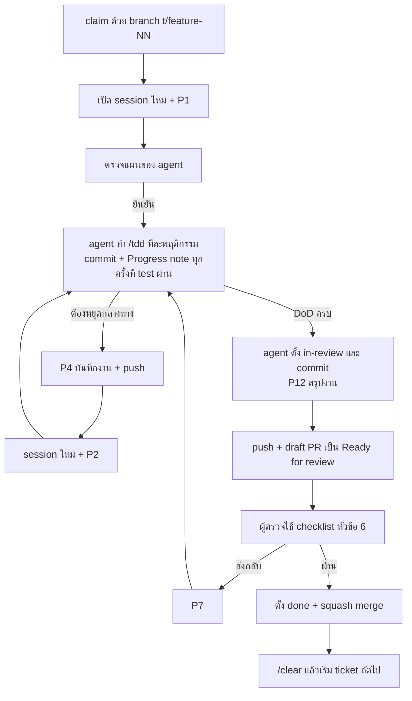

# คู่มือทำงานกับ AI agent

วิธีใช้ AI coding agent ทำงานในโปรเจกต์นี้ให้ผลคงที่: คุม context, ล้างความจำระหว่างงาน, ทำต่อเมื่อเครดิตหมด และตรวจงานก่อนรับ เครื่องมือหลักคือ Claude Code (extension ของ VS Code หรือ CLI) เครื่องมืออื่นอยู่ในหัวข้อ 8

ข้อความ prompt ที่คัดลอกไปใช้ได้อยู่ใน [`PROMPTS.md`](PROMPTS.md) (อ้างเป็น P1, P2, …) และกติกาของทีมอยู่ใน [`TEAMWORK.md`](TEAMWORK.md)

## ทางลัด

| ตอนนี้ | ทำ 3 ขั้นนี้ |
| --- | --- |
| **ใกล้หมด** (`/usage` เกิน 80% หรือขึ้นคำเตือน) | 1. สั่ง P4 "บันทึกงาน" ก่อนเริ่มพฤติกรรมถัดไป 2. `git push` 3. ทำงานในหัวข้อ 5.4 |
| **เครดิตเพิ่งหมดกลางงาน** | 1. `git status` ดูว่ามีไฟล์ค้าง 2. `git add -A` (ดูว่าไม่มี `.env`) แล้ว `git commit -m "wip: <feature>-<NN> ค้างที่ ..."` และ `git push` 3. ดูเวลารีเซ็ตใน claude.ai → Settings → Usage ถ้างานไม่ด่วน หยุดแค่นี้ แล้วกลับมาด้วยแถวถัดไป ทางอื่นอยู่ในหัวข้อ 5.3 |
| **กลับมาทำต่อ** | 1. `git switch t/<feature>-<NN>` แล้ว `git pull --ff-only` 2. `/clear` หรือเปิด session ใหม่ 3. ส่ง P2 (ไม่ต้องพิมพ์ path) แล้วอ่านสรุปก่อนตอบ "ไป" |
| **จะเลิกงานวันนี้** | 1. สั่ง P4 "บันทึกงาน" 2. `git push` 3. โพสต์ 3 บรรทัดในกลุ่มตาม `TEAMWORK.md` หัวข้อ 3 |
| **agent ออกนอกทาง** | 1. กด Esc 2. ส่ง P10 3. ถ้าแก้ทางครบ 2 ครั้งแล้วยังผิด ให้ P4 แล้วเริ่ม session ใหม่ |

## 1. หลัก 3 ข้อของทีม อยู่ตรงไหนในระบบนี้

| หลักที่ทีมเสนอ | ระบบนี้ทำอย่างไร | อยู่ที่ไหน |
| --- | --- | --- |
| **คุม context** | agent โหลด `CLAUDE.md` ไฟล์เดียวทุก session แล้วเปิดเอกสารอื่นเฉพาะที่งานต้องใช้ ticket หนึ่งใบถูกตัดให้จบได้ใน context เดียว คนใส่แค่ ticket กับไฟล์ที่เกี่ยวข้องด้วย `@` | `CLAUDE.md`, หัวข้อ 3 |
| **ล้างความจำระหว่างงาน** | แทน `TODO.md` ด้วยไฟล์ ticket ที่มีช่องติ๊ก acceptance criteria, บรรทัด `Status` และ Progress note แล้ว `/clear` หลังทุก ticket | `docs/ROADMAP.md` หัวข้อ State machine ของ ticket, หัวข้อ 4 |
| **คนเป็นผู้ตรวจ** | agent ส่งงานได้ถึง `in-review` คนเป็นผู้ตั้ง `done` และทุก PR ต้องมีคนที่ไม่ใช่เจ้าของ approve | หัวข้อ 6, `TEAMWORK.md` หัวข้อ 6 |

ระบบนี้เพิ่มอีก 2 ข้อที่ทีมยังไม่ได้เสนอ

- **ความจำอยู่นอก chat:** agent commit ทุกครั้งที่ test ผ่านหนึ่งพฤติกรรม และเขียน Progress note ลงไฟล์ ticket ถ้าเครดิตหมดกะทันหัน งานหายไม่เกินหนึ่งพฤติกรรม และ session ใหม่ เพื่อน หรือเครื่องมืออื่นทำต่อได้ทันที (หัวข้อ 5)
- **test เป็นรั้ว:** agent เขียน test ที่ล้มก่อนแล้วค่อยเขียนโค้ด (`/tdd`) และ `make check` ต้องผ่านก่อนส่งตรวจ ผู้ตรวจจึงอ่านจาก test ได้ว่างานทำอะไร

**ทำไมไม่ใช้ `TODO.md` ไฟล์เดียว:** รายการงานทั้งโปรเจกต์ในไฟล์เดียวจะยาวขึ้นเรื่อยๆ และ agent ต้องโหลดทั้งไฟล์ทุกครั้ง ไฟล์ ticket ละใบทำให้ agent โหลดแค่งานที่ทำอยู่ บอกได้ว่าใบไหนรอใบไหน (`Blocked by`) และเก็บ Progress note ของงานนั้นไว้กับตัว ส่วนภาพรวมอยู่ใน `docs/ROADMAP.md`

## 2. วงจรของหนึ่ง ticket



1. **claim:** ตาม `docs/ROADMAP.md` หัวข้อ Claim (สร้าง branch `t/<feature>-<NN>` push แล้วเปิด draft PR)
2. **เริ่ม:** เปิด session ใหม่ แล้วใช้ P1 agent จะอ่าน ticket กับเอกสารที่เกี่ยวข้องและเสนอแผน เมื่อคุณยืนยัน agent จะบันทึกแผนกับ seam ลง Progress note แล้ว commit ก่อนเขียน test แรก P1 ใช้แทน `/implement` ที่ `/ask-matt` แนะนำ เพราะเพิ่มขั้นยืนยันแผนกับ seam และ commit ทุกพฤติกรรม
3. **ตรวจแผน:** ดูว่าพฤติกรรมตรงกับ acceptance criteria และไฟล์ที่จะแตะอยู่ในขอบเขต ถ้างานแตะหลายไฟล์ให้เปิด plan mode (Shift+Tab) ใน VS Code แผนจะเปิดเป็นเอกสาร markdown ที่ใส่ความเห็นรายบรรทัดได้
4. **ระหว่างทำ:** ดูเป็นระยะ ถ้าออกนอกทางให้กด Esc แล้วใช้ P10 ทันที
5. **หยุดกลางทาง:** P4 แล้ว push
6. **ส่งตรวจ:** agent ตั้ง `in-review` แล้ว commit เมื่อครบ Definition of Done ใน `docs/GUIDELINES.md` ใช้ P12 ให้ได้สรุปสำหรับคำอธิบาย PR คน push เปลี่ยนชื่อ PR ตาม `docs/GUIDELINES.md` หัวข้อ 7 แล้วเปลี่ยน draft PR เป็น Ready for review
7. **ตรวจ:** คนที่ไม่ใช่เจ้าของใช้ checklist ในหัวข้อ 6
8. **ปิด:** ผู้ตรวจตั้ง `done` แล้ว squash merge เจ้าของ `/clear` แล้วเริ่มใบถัดไป

## 3. คุม context

**ที่ Claude Code โหลดเองทุก session:** `CLAUDE.md` ของโปรเจกต์ (และ `~/.claude/CLAUDE.md` ส่วนตัวถ้ามี), คำอธิบายของ skill และ `MEMORY.md` ของ auto memory ถ้ายังเปิดอยู่ (โปรเจกต์นี้ปิดไว้ตาม `TEAMWORK.md` หัวข้อ 5 ตรวจได้ด้วย `/memory`) ใน VS Code ข้อความที่เลือกไว้ในไฟล์ที่เปิดอยู่จะถูกแนบไปกับ prompt เอง กด X ที่ตัวแนบเพื่อเอาออก

**ที่คนควรใส่:**

- ticket: agent หาเองจากชื่อ branch ถ้าจะชี้ใบอื่นให้ใช้ `@.scratch/<feature>/issues/<NN>-<slug>.md`
- ไฟล์โค้ดที่รู้แน่ว่าเกี่ยว: `@apps/api/src/backoffice/ingest/api.py`
- เฉพาะช่วงบรรทัด: `@apps/api/src/backoffice/ingest/service.py#40-80`
- ทั้งโฟลเดอร์ (ใส่ `/` ท้าย): `@apps/api/src/backoffice/ingest/`
- ไฟล์ที่เปิดอยู่พร้อมส่วนที่เลือก: กด Alt+K

เอกสารใน `docs/` ไม่ต้องใส่เอง `CLAUDE.md` บอก agent แล้วว่างานแบบไหนต้องเปิดไฟล์ไหน ใส่ `@docs/...` เฉพาะเมื่ออยากบังคับให้อ่าน

**ดูว่า context ใช้ไปเท่าไร:** `/context` แสดงสิ่งที่อยู่ใน context และจำนวน token ความแม่นของโมเดลลดลงเมื่อ context เต็มขึ้น ถ้าเกินประมาณ 150,000 token หรือเริ่มเห็นอาการในหัวข้อ 10 ให้บันทึกงานแล้วเริ่ม session ใหม่

**ให้ context หลักสะอาด:**

- งานสำรวจที่ต้องอ่านหลายไฟล์ ให้สั่ง "ใช้ subagent สำรวจว่า … แล้วสรุปกลับมา" subagent อ่านใน context ของตัวเอง แล้วส่งกลับแค่ผลสรุป
- ผลลัพธ์ยาว เช่น log หรือผล test ทั้งชุด ให้เขียนลงไฟล์แล้วชี้ไฟล์ หรือสั่งให้แสดงเฉพาะส่วนที่ล้ม
- ระหว่างทำ ให้รัน test เฉพาะไฟล์ที่เกี่ยว และรันชุดเต็มครั้งเดียวตอนท้าย

## 4. ล้างความจำระหว่างงาน

ความจำของงานอยู่ใน ticket กับ git ไม่ได้อยู่ใน chat จึงล้าง chat ได้บ่อยโดยไม่เสียอะไร กฎเดียวที่ต้องจำคือ **ก่อนล้าง ให้บันทึกสิ่งที่ตัดสินใจแล้วลง repo** (ticket, `docs/` หรือ ADR)

| สถานการณ์ | ทำอะไร |
| --- | --- |
| ticket ส่ง `in-review` หรือ merge แล้ว | `/clear` แล้วเริ่มใบถัดไปด้วย P1 |
| ticket ยังไม่เสร็จ แต่ context ยาวหรือ agent เริ่มหลง | P4 → `/clear` → P2 |
| คนแก้ทางให้ agent เรื่องเดิมครบ 2 ครั้งแล้วยังไม่ถูก | P4 → `/clear` → P2 แล้วเขียนสิ่งที่เรียนรู้ลงใน prompt แรก (คำแนะนำจาก best practices ของ Anthropic) |
| context ใกล้เต็มก่อน `/to-tickets` เสร็จ | อยู่ session เดิมต่อ เพราะ `/to-tickets` ต้องใช้เหตุผลจากการ grill ถ้าจำเป็นให้ `/compact` ที่ขอบระหว่างขั้น (หลังตอบคำถามรอบนั้นจบ หรือหลัง `/to-spec` เขียน `spec.md` แล้ว) เช่น `/compact เก็บคำตอบที่ตกลงแล้ว เหตุผลของการแบ่งงาน seam และคำถามที่ยังเปิด` แล้วต่อด้วย `/to-tickets .scratch/<feature>/spec.md` |
| พักสั้นแล้วอยากกลับ session เดิม | VS Code: ปุ่ม Session history ด้านบนของแผง Claude Code, CLI: `claude --continue` (session ล่าสุด) หรือ `claude --resume` (เลือกจากรายการ) |
| `/clear` ไปแล้วแต่อยากได้ session เดิมคืน | `/resume` แล้วเลือก session เดิม session ที่ clear ไปแล้วยังถูกเก็บไว้ |
| agent แก้ไฟล์ผิดทาง อยากย้อน | กด Esc สองครั้ง (ตอนช่องพิมพ์ว่าง) หรือ `/rewind` แล้วเลือก Restore code checkpoint ถูกสร้างทุกครั้งที่ส่ง prompt แต่ใช้แทน git ไม่ได้ |
| ส่งงานให้เพื่อนหรือเครื่องมืออื่น | P4 → push → เพื่อนใช้ P2 หรือเครื่องมืออื่นใช้ P11 |

เหตุผลเบื้องหลังตารางนี้อยู่ใน `/ask-matt` หัวข้อ Phase boundaries

**ทำให้อัตโนมัติ (ไม่บังคับ ทำหลังผ่าน G0 ถ้ายังรู้สึกว่าต้องใช้):** Claude Code มี hook ชื่อ `SessionStart` ที่รันคำสั่งตอนเปิด session และนำผลลัพธ์เข้า context ได้ ให้เขียน hook ที่พิมพ์ชื่อ branch ปัจจุบันกับ Progress note ของ ticket ที่ตรงกับ branch นั้น session ใหม่ทุกครั้งจะเริ่มจากสถานะล่าสุดโดยไม่ต้องพิมพ์ P2 เอง

## 5. เมื่อเครดิตหรือโควตาหมด

### 5.1 รู้ว่าตัวเองใช้แบบไหน

| แบบ | ขีดจำกัด | ดูที่เหลืออย่างไร |
| --- | --- | --- |
| แผนสมาชิก (Pro, Max, Team) | โควตาเป็นรอบ 5 ชั่วโมงนับจากเริ่มใช้ และมีเพดานการใช้รวมรายสัปดาห์อีกชั้น | `/usage` ใน Claude Code หรือ claude.ai → Settings → Usage (เห็นเวลาที่จะรีเซ็ตของทั้งสองชั้น) |
| API key จาก Console | เครดิตเติมล่วงหน้า หมดแล้วเรียกไม่ได้จนกว่าจะเติม | `/usage` (หรือ `/cost`) ใน Claude Code และหน้า Billing ของ Console |

### 5.2 ป้องกันล่วงหน้า

- ดู `/usage` ก่อนเริ่ม ticket ถ้าโควตาเหลือน้อย ให้เลือกใบเล็ก หรือทำงานที่ไม่ใช้ AI ในหัวข้อ 5.4
- agent commit ทุกครั้งที่ test ผ่านหนึ่งพฤติกรรม (กำหนดไว้ใน `CLAUDE.md`) ถ้าหมดกะทันหัน งานหายไม่เกินหนึ่งพฤติกรรม
- ถ้า `/usage` แสดงว่าใช้รอบ 5 ชั่วโมงไปเกิน 80% หรือ Claude Code ขึ้นคำเตือนว่าใกล้ถึง limit ให้สั่ง P4 ทันทีก่อนเริ่มพฤติกรรมถัดไป เพราะเมื่อหมดแล้ว agent จะเขียน Progress note ให้ไม่ได้

### 5.3 หมดกลางงาน

1. **งานไม่หาย:** ไฟล์ที่ agent แก้ยังอยู่บนดิสก์ commit อยู่ใน git และ session ถูกเก็บไว้
2. **บันทึกเองด้วย git** เมื่อ agent ยังไม่ได้เขียน Progress note

   ```bash
   git status
   git add -A
   git commit -m "wip: <feature>-<NN> ค้างที่ <สิ่งที่กำลังทำ>"
   git push
   ```

   ก่อน `git add -A` ให้ดูผล `git status` ว่าไม่มี `.env` หรือไฟล์ข้อมูลจริงหลุดเข้ามา Progress note ใน commit นี้จะเก่ากว่างานจริงหนึ่งขั้น ขั้น "เริ่มหรือทำต่อ" ใน `CLAUDE.md` ให้ agent ดู `git show --stat` ของ commit `wip:` ที่ใหม่กว่า Progress note อยู่แล้ว
3. **เลือกทางต่อ**

| ทาง | เหมาะเมื่อ | ทำอย่างไร |
| --- | --- | --- |
| รอรีเซ็ต (ทางตั้งต้น) | งานไม่ด่วน | ทำงานในหัวข้อ 5.4 ระหว่างรอ หลังรีเซ็ต `/clear` แล้วใช้ P2 |
| เปิด usage credits | งานด่วน | claude.ai → Settings → Usage → Usage credits กด Enable และตั้ง monthly spend limit ทุกครั้ง คิดราคาตาม API |
| ให้เพื่อนทำต่อ | เพื่อนยังมีโควตา | push branch แล้วเพื่อนทำขั้น "ส่งต่อให้คนอื่น" ใน `docs/ROADMAP.md` และใช้ P2 |
| ใช้เครื่องมืออื่น | ทุกคนหมด | หัวข้อ 8 และ P11 |

### 5.4 งานที่ทำได้โดยไม่ใช้ AI

- ตรวจ PR ของเพื่อนตาม checklist ในหัวข้อ 6
- ทดสอบด้วยมือบนเครื่องหรือ staging
- ติดคำตอบใน Golden Set ตาม `docs/EVALS.md`
- สัมภาษณ์ลูกค้าและสำนักงานบัญชี (M0.2) หรือคุยกับ CPA เรื่องกฎที่ติด `needs-cpa-review`
- เขียน acceptance criteria ของ milestone ถัดไป

### 5.5 ประหยัดโควตา

- **ใช้ ticket ขนาดที่ `/to-tickets` ตั้งไว้** ถ้าใบไหนทำเกินหนึ่ง session ให้แตกใบใหม่
- **วางแผนก่อนงานหลายไฟล์** ใน plan mode ถูกกว่าการลองผิดแล้วย้อน
- **`/clear` ระหว่าง ticket** ทุก prompt ส่ง context ทั้งหมดไปใหม่ context ยาวจึงกินโควตามากขึ้นทุกรอบ
- **ชี้ไฟล์แทนการแปะ** log และผล test ยาว
- **เลือกโมเดลตามงาน** ด้วย `/model` ใช้โมเดลใหญ่กับการวางแผน การตรวจ และบั๊กที่ยาก และใช้โมเดลที่เล็กกว่ากับงานที่เป็นกลไกชัดเจน
- **หยุดเมื่อวน** กฎใน `docs/GUIDELINES.md` ให้ agent หยุดถามเมื่อแก้เรื่องเดิมไม่ผ่านครบ 3 รอบ
- **ใช้ subagent เมื่อช่วยให้ context หลักสะอาด** subagent ก็ใช้โควตาเหมือนกัน

## 6. บทบาทผู้ตรวจ

คนเปลี่ยนจากคนเขียนโค้ดเป็นผู้ออกแบบและผู้ตรวจ ใช้เวลาประมาณ 15–30 นาทีต่อ PR ถ้า PR ใหญ่จนตรวจไม่จบใน 30 นาที ให้ส่งกลับไปแตกเป็นหลาย ticket

### ก. ก่อนอ่านโค้ด

- [ ] CI ผ่าน
- [ ] คำอธิบาย PR (จาก P12) มีสรุป `/code-review` และไม่มีข้อร้ายแรงค้าง
- [ ] คำอธิบาย PR ตอบครบทุก acceptance criteria ใน ticket และชื่อ PR ตาม `docs/GUIDELINES.md` หัวข้อ 7
- [ ] ถ้าแตะ prompt, โมเดล, pipeline หรือ Check: ตาราง eval เต็มชุดเทียบ baseline อยู่ในคำอธิบาย PR และผ่านเกณฑ์ใน `docs/EVALS.md`
- [ ] ผู้ approve มีสิทธิ์ตาม `docs/GUIDELINES.md` หัวข้อ 7 (ดูแท็บ Commits ของ PR)

### ข. อ่าน diff

- [ ] **test:** ชื่อ test บอกพฤติกรรม ค่าที่คาดหวังมาจาก ticket หรือตัวอย่างจริง ไม่ได้คำนวณแบบเดียวกับโค้ด
- [ ] **test เดิม:** ไม่มี test ที่ถูกลบ ผ่อนเงื่อนไข หรือติด `skip` หรือ `xfail` โดยไม่มีเหตุผลใน ticket
- [ ] **ขอบเขต:** ไฟล์ที่แตะตรงกับ ticket ไม่มี feature ที่ไม่ได้ขอ ไม่มี dependency ใหม่ที่ยังไม่ได้ตกลง
- [ ] **กฎเหล็กใน `CLAUDE.md`:** เงินใช้ `Decimal`, query ผูก tenant, LLM ไม่ได้เป็นผู้ตัดสิน, เนื้อหาเอกสารไม่ถูกใช้เป็นคำสั่ง
- [ ] **ความลับ:** ไม่มี secret ในโค้ด ไม่มีเนื้อหาเอกสารลูกค้าใน log นอก environment `local`
- [ ] **migration:** ย้อนกลับได้ และ `docs/DATA_MODEL.md` อัปเดตแล้ว
- [ ] **คำศัพท์:** ชื่อในโค้ดตรงกับ `CONTEXT.md`

### ค. อาการที่มักเจอในโค้ดที่ AI เขียน

- เรียกฟังก์ชันหรือ library ที่ไม่มีอยู่จริง (ดูว่า import มีใน `pyproject.toml` และเรียกถูกเวอร์ชัน)
- จับ exception แล้วเงียบ เพื่อให้ test ผ่าน
- โครงสร้างเผื่ออนาคตที่ ticket ไม่ได้ขอ
- โค้ดซ้ำที่ควรเรียกฟังก์ชันกลางที่มีอยู่แล้ว เช่น `normalize_thai()` หรือ `thai_dates.py`
- test ที่ mock ตัวที่กำลังทดสอบ จนไม่ได้ทดสอบอะไร
- ความเห็น `TODO` ที่ไม่ได้เปิดเป็น ticket

### ง. ทดสอบด้วยมือ

- [ ] รันบนเครื่องตาม "วิธีทดสอบด้วยมือ" ใน PR
- [ ] feature ที่ผ่าน LINE ให้ลองในกลุ่ม LINE ของ staging
- [ ] ข้อความไทยบนจอสั้น ถูกคำ และบอกผู้ใช้ว่าต้องทำอะไรต่อ ตาม `docs/GUIDELINES.md` หัวข้อ 6

### จ. ตัดสิน

ผู้ตรวจแก้ไฟล์ ticket บน branch ของ PR เสมอ เพราะ `main` รับเฉพาะ PR รัน `git fetch` แล้ว `git switch t/<feature>-<NN>` และ `git pull --ff-only` ก่อนแก้ ถ้ากำลังทำ ticket ของตัวเองค้างอยู่ ให้ใช้ `git worktree add ../review-<feature>-<NN> t/<feature>-<NN>` แทนการ switch

- **ผ่าน:** ตั้ง `**Status:** done` ใน ticket commit `chore(ticket): done <feature>-<NN>` แล้ว push ก่อน จากนั้นค่อย approve รอ CI ผ่าน แล้ว squash merge
- **ไม่ผ่าน:** เขียนเหตุผลเป็นข้อๆ ใต้ `## Comments` ของ ticket ตั้งสถานะกลับเป็น `in-progress` commit `docs(ticket): review <feature>-<NN>` แล้ว push เจ้าของใช้ P7

ความเห็นที่เขียนบนหน้า PR ของ GitHub agent มองไม่เห็น ให้ใส่ความเห็นที่ต้องแก้ไว้ใน `## Comments` เสมอ

## 7. ทำหลาย ticket พร้อมกัน

ไม่บังคับ ใช้เมื่อคล่องกับวงจรปกติแล้ว git worktree ให้แต่ละ ticket มีโฟลเดอร์ของตัวเอง agent สองตัวจะไม่แก้ไฟล์ทับกัน ticket ที่สองต้อง claim ใน worktree ใหม่ เพราะถ้าใช้ `git switch -c` ในโฟลเดอร์หลัก งานของ ticket แรกจะติดไปด้วยและ `git worktree add` จะล้ม

```bash
git fetch origin
git ls-remote --heads origin t/<feature>-<NN>   # ต้องไม่มีผลลัพธ์
git worktree add -b t/<feature>-<NN> ../ai-backoffice-<feature>-<NN> origin/main
cd ../ai-backoffice-<feature>-<NN>
```

จากนั้นทำ Claim ขั้น 3–4 ใน `docs/ROADMAP.md` ในโฟลเดอร์นี้ คัดลอก `.env` จากโฟลเดอร์หลัก ติดตั้ง dependency ตาม `README.md` แล้ว `code .` เปิด Claude Code ในหน้าต่างใหม่นั้นแล้วเริ่มด้วย P1 เมื่อ merge แล้วให้ลบด้วย `git worktree remove ../ai-backoffice-<feature>-<NN>`

Claude Code มีคำสั่ง `claude --worktree <name>` ที่สร้าง worktree ใน `.claude/worktrees/<name>/` ให้เองได้ แต่ branch ที่ได้ชื่อ `worktree-<name>` วิธีนี้ไม่ตรงกับกติกา claim จึงใช้ `git worktree add` แทน

แต่ละคนเปิดพร้อมกันไม่เกิน 2 ตัว ตามเหตุผลใน `TEAMWORK.md` หัวข้อ 4

## 8. ใช้เครื่องมืออื่นแทน Claude Code

**เลือกเครื่องมือสำรองไว้ตัวเดียวล่วงหน้า** แนะนำ GitHub Copilot agent mode เพราะอยู่ใน VS Code เดิมและอ่าน `CLAUDE.md` เอง ทุกคนลองทำ ticket เล็กหนึ่งใบด้วย P11 ในวันที่ยังมีโควตา และใส่ค่าใช้จ่ายไว้ในงบของ `TEAMWORK.md` หัวข้อ 9 ตารางด้านล่างเก็บไว้อ้างอิงเมื่ออยากเปลี่ยนตัว

ใช้เมื่อโควตา Claude ของทุกคนหมด กติกาอยู่ใน `CLAUDE.md` และ ticket อยู่ใน `.scratch/` ซึ่งทุกเครื่องมืออ่านได้ ส่วน `AGENTS.md` ที่ root มีไว้ชี้ไปที่ `CLAUDE.md` สำหรับเครื่องมือที่อ่านแค่ `AGENTS.md` (Claude Code ข้ามไฟล์นี้เมื่อมี `CLAUDE.md` จึงไม่โหลดซ้ำ)

| เครื่องมือ | โหลดกติกาเองจาก | ใส่ไฟล์เข้า context | เริ่ม context ใหม่ |
| --- | --- | --- | --- |
| Cursor | `CLAUDE.md` และ `AGENTS.md` ทุก chat, `.cursor/rules/*.mdc` | `@ไฟล์`, `@โฟลเดอร์/` | New Chat (Ctrl+N), ใน Cursor CLI ใช้ `/clear` |
| GitHub Copilot (agent ใน VS Code) | `CLAUDE.md`, `AGENTS.md`, `.github/copilot-instructions.md` (เปิดเป็นค่าเริ่มต้น) | พิมพ์ `#` ตามด้วยชื่อไฟล์ หรือลากไฟล์ใส่ช่อง chat | `/clear` หรือ New Chat (Ctrl+N) |
| Cline | `AGENTS.md` และ `.clinerules/` หรือ `.cline/rules/` (ไม่อ่าน `CLAUDE.md` เอง) | `@/path/to/file`, `@/folder/` หรือลากไฟล์มาวาง | ปุ่ม + ในแถบข้าง (`/newtask` ยกสรุปของ task เก่ามาด้วย จึงไม่ใช่การล้างความจำ) |
| OpenAI Codex CLI | `AGENTS.md` (ไม่อ่าน `CLAUDE.md` เอง) | พิมพ์ `@` แล้วค้นไฟล์ หรือ `/mention` | `/new` หรือ `/clear` |
| Gemini CLI | `GEMINI.md` ถ้าจะให้อ่าน `AGENTS.md` ให้ตั้ง `"context": {"fileName": ["AGENTS.md", "GEMINI.md"]}` ใน settings | `@path` | `/clear` |
| Aider | ไม่โหลดเอง ตั้ง `read: [CLAUDE.md, AGENTS.md, CONTEXT.md, docs/GUIDELINES.md, docs/ROADMAP.md]` ใน `.aider.conf.yml` หรือพิมพ์ `/read-only` ตาม P11 | `/add` (ไฟล์ที่จะแก้), `/read-only` (ไฟล์อ้างอิง) | `/clear` (ล้าง chat) หรือ `/reset` (ล้าง chat และไฟล์) |

เริ่มทุกเครื่องมือด้วย P11 ซึ่งสั่งให้อ่าน `CLAUDE.md` ก่อน แล้วทำตามขั้น "เริ่มหรือทำต่อ"

**สิ่งที่ต่างจาก Claude Code:**

- skill ใน `.claude/skills/` เช่น `/tdd` และ `/to-tickets` เรียกด้วย `/` ไม่ได้ `AGENTS.md` บอกให้เปิด `SKILL.md` ของ skill นั้นแล้วทำตามขั้นเอง
- งานที่ทำในเครื่องมืออื่นต้องผ่าน `/code-review` ของ Claude Code ก่อน merge เมื่อโควตากลับมา ถ้ารอไม่ได้ ผู้ตรวจต้องตรวจตามหัวข้อ 6 ครบทุกข้อ ยกเว้นข้อสรุป `/code-review` ซึ่งให้เขียนใน PR ว่ายังไม่ได้รัน
- git-guardrails เป็น hook ของ Claude Code เท่านั้น ในเครื่องมืออื่นให้ปิดการอนุมัติคำสั่ง terminal อัตโนมัติ และตอบปฏิเสธเมื่อ agent ขอรัน `git push`, `reset --hard`, `clean` หรือ `branch -D`
- ใช้ API key หรือบัญชีส่วนตัวที่ตั้ง spend limit แล้ว API key ของผลิตภัณฑ์ใน `.env` ใช้กับระบบเท่านั้น ตาม `TEAMWORK.md` หัวข้อ 9
- ความสามารถของโมเดลต่างกัน ให้ใช้กับ ticket เล็กและชัด และให้ agent ทำ Progress note กับ commit ตาม `CLAUDE.md` เหมือนเดิม เพื่อให้กลับมาทำต่อใน Claude Code ได้

## 9. คำสั่ง Claude Code ที่ใช้บ่อย

| ต้องการ | คำสั่งหรือปุ่ม |
| --- | --- |
| ใส่ไฟล์ โฟลเดอร์ หรือช่วงบรรทัดเข้า context | `@path`, `@folder/`, `@file#5-10` หรือ Alt+K ใน VS Code |
| ดูว่า context มีอะไรและใช้ไปเท่าไร | `/context` |
| ดูโควตาที่เหลือ หรือค่าใช้จ่ายของ API key | `/usage` (`/cost` เป็นชื่อเรียกอีกแบบ) |
| ดู model, working directory และสถานะของ session | `/status` |
| หยุด agent กลางทาง | Esc |
| เข้าหรือออก plan mode | Shift+Tab |
| ล้าง context | `/clear` |
| ย่อ context โดยบอกว่าต้องเก็บอะไร | `/compact <สิ่งที่ต้องเก็บ>` |
| กลับ session เก่า | `/resume`, ปุ่ม Session history ใน VS Code, `claude --continue`, `claude --resume` |
| ย้อนไฟล์หรือบทสนทนา | Esc สองครั้ง หรือ `/rewind` |
| เปลี่ยนโมเดล | `/model` |
| ดูหรือแก้ไฟล์ความจำ (`CLAUDE.md` ทุกระดับ) | `/memory` |
| เก็บบทสนทนาเป็นไฟล์ | `/export <ชื่อไฟล์>` |
| เปิดบทสนทนาใหม่ในแท็บใหม่ของ VS Code | Command Palette (Ctrl+Shift+P) → Claude Code: Open in New Tab (บน Windows ปุ่ม Ctrl+Shift+Esc จะเปิด Task Manager แทน) |

## 10. อาการผิดปกติและวิธีแก้

| อาการ | สาเหตุที่พบบ่อย | ทำอะไร |
| --- | --- | --- |
| agent ลืมกฎใน `CLAUDE.md` | context ยาวมาก หรือเพิ่ง `/compact` | P4 แล้วเริ่ม session ใหม่ ถ้าเกิดซ้ำ ให้ยกเข้า retro เพื่อเขียนกฎให้ชัดขึ้นหรือเพิ่ม check อัตโนมัติ |
| แก้บั๊กเดิมวนไม่จบ | ยังไม่มี test ที่ล้มบนบั๊กนั้น | P10 ข้อสอง แล้วใช้ P6 (`/diagnosing-bugs`) |
| ลบหรือแก้ test ให้ผ่าน | prompt สั่งแค่ "ทำให้ผ่าน" | ส่งกลับ และใช้หลัก "คง test ไว้" ใน `PROMPTS.md` |
| เรียก API หรือ library ที่ไม่มีจริง | โมเดลเดาจากความจำ | สั่งให้รันจริงหรือเปิด source ของ library ให้ดู แล้วตรวจ `pyproject.toml` |
| ทำเกิน ticket | ticket กว้างเกินไป หรือ prompt ไม่ได้กำหนดขอบเขต | P10 ข้อแรก ถ้าเกิดบ่อยให้แตก ticket ให้เล็กลง |
| ช้ามากหรือกินโควตามาก | ticket ใหญ่ อ่านไฟล์ใหญ่ หรือรัน test ชุดเต็มบ่อย | หัวข้อ 5.5 |
| หลัง `/compact` ตัดสินใจขัดกับที่ตกลงไว้ | บทสรุปทำให้รายละเอียดหาย | ชี้ไปที่ ADR หรือ ticket ที่บันทึกการตัดสินใจ ถ้ายังไม่ได้บันทึก ให้บันทึกก่อน |
| agent บอกว่าเอกสารสองไฟล์ขัดกัน | เอกสารล้าหลังโค้ดหรือกันเอง | ตัดสินว่าไฟล์ไหนถูก แล้วแก้อีกไฟล์ผ่าน PR ในวันนั้น |
