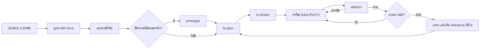

# สูตรเริ่มโปรเจกต์ใหม่กับ AI agent

ใช้ได้กับทุกโปรเจกต์ ไม่เฉพาะ AI Back-Office โปรเจกต์นี้เป็นตัวอย่างของสูตรนี้ทั้งชุด เปิดไฟล์จริงเทียบได้ทุกขั้น

## 1. ภาพรวม



## 2. ขั้นตอน

1. **เขียนเป้าหมาย 3 บรรทัด:** ใครใช้ ปัญหาอะไร และวัดความสำเร็จด้วยตัวเลขอะไร ถ้าเขียน 3 บรรทัดนี้ไม่ได้ ให้ใช้ `/grill-me` ก่อนสร้างโฟลเดอร์
2. **สร้าง repo:** สร้างโฟลเดอร์ แล้วตั้งค่าตาม [`TEAMWORK.md`](TEAMWORK.md) หัวข้อ 5 ทุกขั้น (git, `.gitignore`, skill, guardrails, ปิด auto memory, การป้องกัน `main`)
3. **เลือก tracker:** ตอนรัน `/setup-matt-pocock-skills` ในขั้น 2 ให้เลือกตามทีม
   - คนเดียวถึง 3–4 คน และอยากให้ทุกเครื่องมืออ่าน ticket ได้: local markdown (`.scratch/`)
   - ทีมใหญ่กว่านั้น หรือมีคนนอกมาช่วย: GitHub Issues
4. **ขัดไอเดีย:** `/grill-with-docs` ให้ agent สัมภาษณ์จนได้ `CONTEXT.md` (คำศัพท์) และ ADR ของการตัดสินใจที่ย้อนยาก ถ้างานใหญ่จนมองไม่เห็นทางไปถึงเป้า ให้ใช้ `/wayfinder` แทน ticket ของ `/wayfinder` เป็น ticket ตัดสินใจ ใช้สถานะและวิธี claim ของ wayfinder เอง (ไม่ใช้กติกา Claim ใน ROADMAP) ตั้งชื่อ `<effort>` ไม่ให้ซ้ำกับชื่อ feature และเริ่ม ticket งานจริงหลัง `/to-spec`
5. **เขียนเอกสารเท่าที่ขนาดงานต้องการ:** ตามตารางในหัวข้อ 3
6. **ลองของเสี่ยงก่อน:** ความเสี่ยงที่ตอบบนกระดาษไม่ได้ (โมเดลแม่นพอไหม, API ภายนอกทำได้จริงไหม) ให้ตอบด้วย `/prototype` ก่อนเขียน spec
7. **spec และ ticket:** `/to-spec` แล้ว `/to-tickets` ทีละ milestone บน branch `plan/<feature>` แล้วเข้า `main` ผ่าน PR ตาม P8 ใน [`PROMPTS.md`](PROMPTS.md) ทำต่อจากขั้น 4 ใน session เดียวกันโดยไม่ `/clear` เพราะ spec ต้องใช้เหตุผลจากการสัมภาษณ์ ส่วน prototype ในขั้น 6 ทำใน session แยก แล้วใช้ `/handoff` พาผลกลับมา
8. **ลงมือ:** ทำตาม [`AI_WORKFLOW.md`](AI_WORKFLOW.md) session หนึ่งทำ ticket เดียว
9. **retro ทุกสัปดาห์:** `/retro` กับ session ที่มีปัญหา แล้วแก้เอกสารหรือเพิ่ม check อัตโนมัติ

## 3. เอกสารตามขนาดงาน

| ขนาดงาน | เอกสารที่ควรมี |
| --- | --- |
| สคริปต์หรือเครื่องมือเล็ก (ไม่เกิน 1 สัปดาห์ คนเดียว) | `CLAUDE.md` สั้นๆ และ ticket ใน `.scratch/` |
| ผลิตภัณฑ์เล็ก (1–3 เดือน 1–3 คน) | เพิ่ม `CONTEXT.md`, `docs/PRD.md`, `docs/ARCHITECTURE.md`, `docs/GUIDELINES.md`, `docs/ROADMAP.md`, `docs/adr/` |
| มีข้อมูลลูกค้า เงิน หรือ AI เป็นแกนของระบบ | เพิ่ม `docs/SECURITY.md`, `docs/API_SPEC.md`, `docs/DATA_MODEL.md`, `docs/EVALS.md` และเอกสารกฎของ domain แบบ `docs/TAX_RULES.md` |
| มีลูกค้าจ่ายเงินแล้ว | เพิ่ม `docs/RUNBOOK.md` (deploy, rollback, รับมือเหตุฉุกเฉิน) |

เอกสารทุกไฟล์ต้องมีคนใช้จริง ถ้าไม่มีใครเปิดอ่านภายในหนึ่งเดือน ให้รวมเข้าไฟล์อื่นหรือลบทิ้ง

## 4. แม่แบบ `CLAUDE.md`

`CLAUDE.md` ถูกโหลดเข้า agent ทุก session ทุกบรรทัดจึงมีต้นทุน ใส่แค่ 4 อย่างนี้

```markdown
# <ชื่อโปรเจกต์>

<หนึ่งย่อหน้า: ระบบนี้ทำอะไร ให้ใคร เฟสปัจจุบันดูที่ไหน>

## อ่านก่อนเริ่มทุกงาน

- `CONTEXT.md`: คำศัพท์ของโปรเจกต์
- `docs/adr/`: การตัดสินใจที่ย้อนยาก

## เอกสารที่ต้องเปิดตามงาน

- **<ประเภทงาน>** → `docs/<ไฟล์>.md`

## กฎเหล็ก

1. **<กฎที่ถ้าพลาดแล้วเสียหายหนัก>** <เหตุผลสั้นๆ หรือเลข ADR>

## วิธีทำงาน

<คัดลอกหัวข้อ "วิธีทำงาน" จาก CLAUDE.md ของ AI Back-Office ทั้งหัวข้อ รวมนิยาม "ไฟล์ของงาน" เพราะ P2, P4 และขั้นตอนตอนโควตาหมดอาศัยคำว่า "เริ่มหรือทำต่อ" "green" และ "บันทึกงาน" ที่นิยามไว้ในนั้น>
```

ตัวอย่างเต็มคือ [`../../CLAUDE.md`](../../CLAUDE.md) ของโปรเจกต์นี้

## 5. หลักการเขียนเอกสารให้ agent อ่าน

- **ชี้ แทนการยัด:** `CLAUDE.md` บอกว่าเรื่องไหนอยู่ไฟล์ไหน และเขียนเงื่อนไขว่าเมื่อไรต้องเปิด
- **ความหมายเดียว อยู่ที่เดียว:** กฎข้อหนึ่งเขียนไว้ไฟล์เดียว ที่อื่นชี้มา เวลาเปลี่ยนจะได้แก้ที่เดียว
- **เขียนสิ่งที่ต้องทำ:** "ใช้ `Decimal` กับเงิน" ได้ผลกว่า "อย่าใช้ float" ใช้คำห้ามเฉพาะกับรั้วที่ห้ามพลาด และเขียนคู่กับสิ่งที่ให้ทำแทน
- **ให้ repo เป็นแหล่งความจริง:** คำสั่งใน `Makefile` หรือ `package.json` ให้ agent อ่านจากไฟล์เอง เอกสารเก็บเฉพาะสิ่งที่หาจากโค้ดไม่เจอ เช่นเหตุผลของการตัดสินใจ
- **ทุกบรรทัดต้องเปลี่ยนพฤติกรรม:** ถ้าลบบรรทัดนั้นแล้ว agent ยังทำเหมือนเดิม บรรทัดนั้นไม่ต้องมี
- อ่านหลักเต็มได้จาก `/writing-for-agents`

## 6. สิ่งที่เจอบ่อยและวิธีแก้

| อาการ | ทำแทน |
| --- | --- |
| เอกสารก้อนเดียวยาวหลายพันบรรทัด | แยกตามเรื่อง แล้วชี้จาก `CLAUDE.md` ตามประเภทงาน |
| `TODO.md` ยาวที่ agent ต้องโหลดทุก session | ticket ละไฟล์ใน `.scratch/` และ `docs/ROADMAP.md` เก็บแค่ระดับ milestone |
| สั่ง "สร้างแอปทั้งตัว" ใน prompt เดียว | `/to-spec` แล้ว `/to-tickets` ให้ได้งานชิ้นที่จบใน session เดียว |
| ทำหลาย ticket ต่อกันใน session เดียว | session หนึ่งทำ ticket เดียว แล้ว `/clear` ก่อนใบถัดไป |
| agent บอกว่าเสร็จแล้วติ๊กเอง | agent ส่งถึง `in-review` คนเป็นผู้ตั้ง `done` |
| ตัดสินใจใน chat แล้วไม่ได้บันทึก | บันทึกลง ticket, `docs/` หรือ ADR ในวันเดียวกัน |
| แก้ prompt ของ LLM ตามความรู้สึก | วัดด้วย eval ก่อนและหลังทุกครั้ง |
| ทำงานยาวทั้งวันโดยไม่ commit | commit ทุกครั้งที่ test ผ่านหนึ่งพฤติกรรม |

## 7. ของที่นำไปใช้ซ้ำจากโปรเจกต์นี้ได้เลย

- หัวข้อ "State machine ของ ticket", "Claim" และ "Progress note" ใน [`../ROADMAP.md`](../ROADMAP.md)
- หัวข้อ "วิธีทำงาน" ใน [`../../CLAUDE.md`](../../CLAUDE.md)
- คู่มือทั้ง 4 ไฟล์ในโฟลเดอร์นี้ แก้เฉพาะชื่อเอกสารและบทบาทให้ตรงกับโปรเจกต์ใหม่
